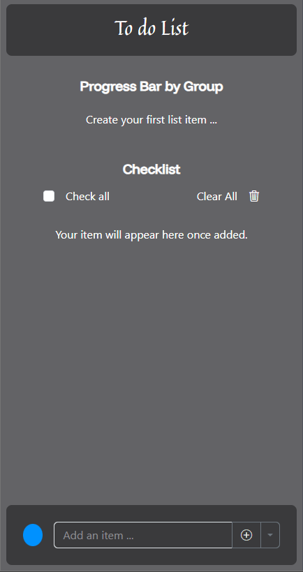

<h1 align="center" style="font-weight: bold;">To-Do-List_Bootstrap 💻</h1>

<p align="center">
 <a href="#tech">Tecnologias</a> •
 <a href="#started">Começando</a> •
 <a href="#structure">Estrutura do projeto</a> •
 <a href="#contribute">Contribuir</a>
</p> 

<p align="center"> 
 <b>Aplicação To-Do List responsiva desenvolvida com foco na manipulação do DOM utilizando JavaScript e estilização com Bootstrap.</b>
</p>

<p align="center">
 <a href="">📱 Visite este projeto</a>
</p>


<h2 id="tech">💻 Tecnologias</h2>

Projeto desenvolvido utilizando as seguintes tecnologias:


<h2 id="layout">🎨 Layout</h2>

<p align="center">
 
</p>


<h2 id="started">🚀 Começando</h2>

Siga as instruções abaixo para executar o projeto localmente.

### Pré-requisitos

Você precisa apenas de um navegador atualizado para rodar o projeto.

Opcional (caso queira rodar com servidor local):

- [NodeJS](https://nodejs.org/pt)

### Cloning

```bash
  git clone https://github.com/guicarbar/To-Do-List_Bootstrap
```


<h2 id="structure">📂 Estrutura do Projeto</h2>

```bash
📦 To-Do-List_Bootstrap  
├── 📄 index.html
├── 📁 style
├── ├── 📁 img(...)
│   └── 📄 style.css
├── 📁  JS
│   ├── 📄 core.js
│   ├── 📄 progressBar.js
│   ├── 📄 completeTask.js
├── 📄 README.md
```


<h2 id="features">✨ Funcionalidades</h2>

- ✅ Adição de tarefas em 5 grupos diferentes  
- 📊 Barra de progresso individual para cada grupo  
- ✔️ Marcar tarefas como concluídas  
- ❌ Excluir tarefas individualmente  
- 🗑️ Excluir todas as tarefas de uma vez  
- ☑️ Marcar todas as tarefas como concluídas  
- 🔄 Desmarcar todas as tarefas simultaneamente  
- 📱 Layout totalmente responsivo (adaptável a qualquer dispositivo)


<h2 id="contribute">📫 Contribuir</h2>

Contribuições são sempre bem-vindas!

1. `git clone https://github.com/guicarbar/To-Do-List_Bootstrap`
2. `git checkout -b feature/Nome-da-branch`
3. Siga os padrões de commits.
4. Abra um Pull Request explicando o problema resolvido ou funcionalidade criada. Se houver, adicione capturas de tela das modificações visuais e aguarde a revisão!


### Documentações que podem ajudar

[📝 Como criar um Pull Request](https://www.atlassian.com/br/git/tutorials/making-a-pull-request)

[💾 Padrão de commits](https://github.com/iuricode/padroes-de-commits)


## 📜 Licença

Este projeto está sob a licença [MIT](LICENSE) License.
